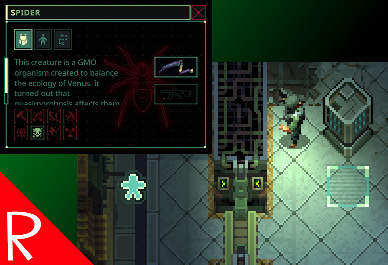

# Command Ally

Allows the user to give commands to ally units that are not in line of site.  For example, robots, spiders, revived soldiers, etc.
This is very helpful when using a unit as a mule as they can be left with a "stand" command and then recalled when you want to load them up.

This only affects units that can be normally commanded.  

# Far Follow
Currently commandable units can get stuck on doors when far away.  This is a limitation with the game.  If this occurs, move the merc closer until the unit can find a path.  Sometimes this is as close as visual distance.

# Buy Me a Coffee
If you enjoy my mods and want to buy me a coffee, check out my [Ko-Fi](https://ko-fi.com/nbkredspy71915) page.
Thanks!

# Source Code
Source code is available on GitHub at https://github.com/NBKRedSpy/CommandAlly
